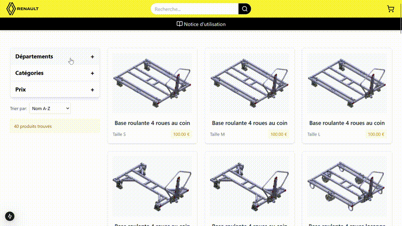
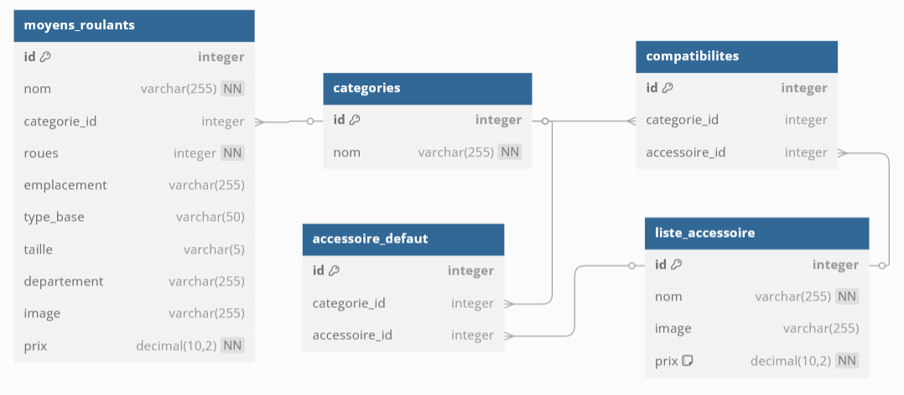

# PROJET_PIL - PIL ISEL



## Description
Ce projet est développé dans le cadre du projet PIL à l'ISEL. Il vise à créer un outil d'aide à la gestion des moyens logistiques non motorisés des usines Renault.

## Prérequis
- Docker

## Installation
1. Clonez le dépôt :
    ```bash
    git clone https://github.com/ynsr22/PIL_ISEL.git
    ```
2. Accédez au répertoire du projet :
    ```bash
    cd PIL_ISEL
    ```
3. Installez les dépendances :
    ```bash
    docker compose up -d --build
    ```

## Utilisation
1. Se connecter au site web
    ```bash
    localhost:3000
    ```

## Schéma base de données relationnelles


## Auteur
- Yanis SRAIRI
- Amira AOUDIA
- Souhail EJNAINI
